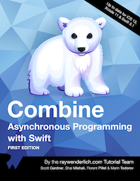

{% assign postsByYear = site.posts | group_by_exp:"post", "post.date | date: '%Y'" %}

  <h1>{{ year.name }}</h1>
  {% assign postsByMonth = year.items | group_by_exp:"post", "post.date | date: '%B'" %}


<h2>{{ month.name }}</h2>
<ul>
  
    <li>
      <a href="{{ post.url }}">{{ post.title }}</a>
       {{ post.excerpt }}  
    </li>
  
</ul>




---
Check out my latest book: [Combine: Asynchronous Programming with Swift](https://store.raywenderlich.com/a/742/link/27)

It's packed with coverage of Combine concepts, hands-on exercises in playgrounds, and complete iOS app projects. Everything you need to _transform yourself_ from novice to expert with Combine — and have fun while doing it!

 This work is licensed under a <a rel="license" href="http://creativecommons.org/licenses/by-nc-nd/4.0/">Creative Commons Attribution-NonCommercial-NoDerivatives 4.0 International License</a>.
 © 2020 Scott Gardner 
